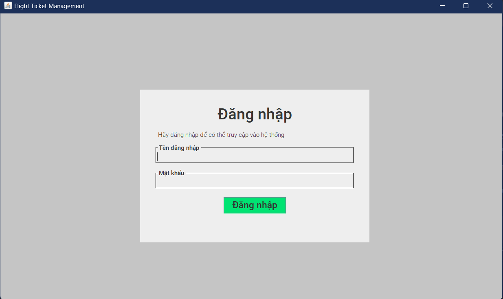
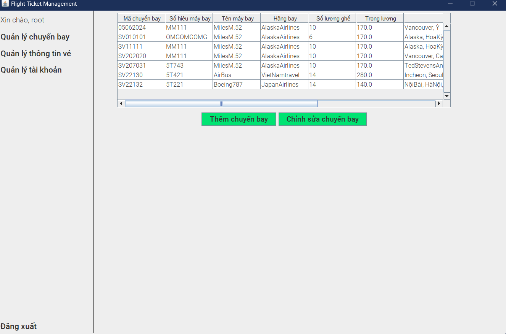
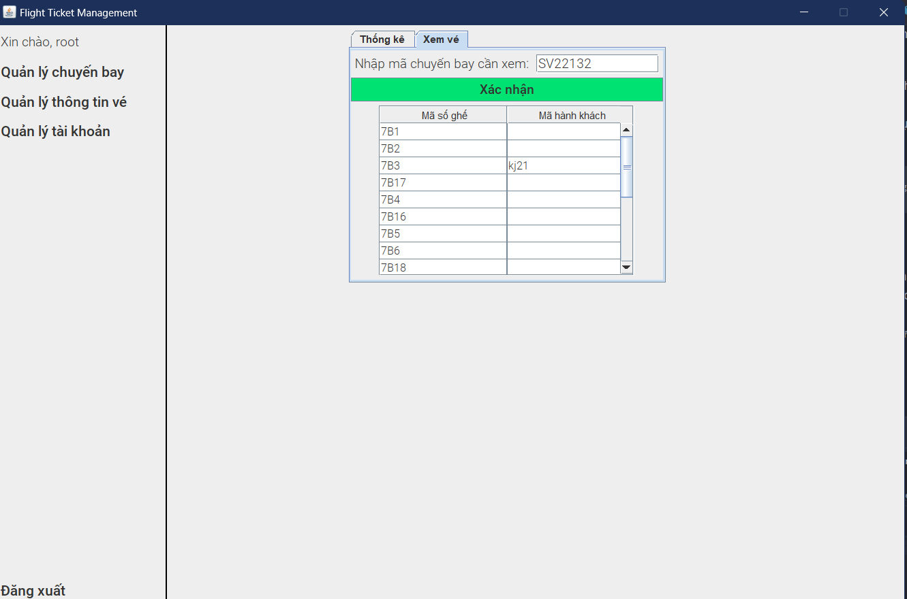

# Đồ án môn Thiết Kế Hướng Đối Tượng nhóm 17 - NLU 2023/2024
## Cài đặt:
- Repository chỉ chứa source code nên cần import code vào 1 project Java có sẵn.
- Chạy code tại `src/controller/Controller.java`

## Mô tả chức năng
### I. Quản lý chuyến bay
1. Có thể thêm thông tin chuyến bay thông qua một file txt có định dạng như sau:
```text
Mã chuyến bay
Số hiệu máy bay|Tên máy bay|Hãng bay|Trọng lượng của máy bay|Trạng thái của chuyến bay
Nơi cất cánh|Nơi hạ cánh
Ngày|Tháng|Năm
Số lượng ghế của máy bay
Mã số ghế|Mã khách hàng
... 
Mã số ghế|Mã khách hàng
```
- Trong đó: 
  + Trạng thái của chuyến bay là true nếu như hạ cánh tại sân bay, false nếu cất cánh tại sân bay
  + Số dòng chứa mã số ghế và mã khách hàng phải bằng với số ghế trong máy bay
  + Nếu ghế chưa có khách hàng thì ghi mã khách hàng là `null`
  + Ngày/tháng/năm được hiểu là thời gian mà chuyến bay cất cánh từ sân bay hoặc hạ cánh tại sân bay

2. Có thể chỉnh sửa thông tin chuyến bay thông qua một file txt được nhập vào với định dạng trên.
3. Mặc định sẽ hiển thị danh sách các chuyến bay lên màn hình ứng dụng. Thông tin được hiển thị như sau:
```text
Mã chuyến bay | Số hiệu máy bay | Tên máy bay | Hãng bay | Số lượng ghế | Trọng lượng | Nơi đi | Nơi đến | Ngày cất cánh
```

### II. Quản lý vé
1. Có thể thống kê số lượng vé bán ra của các chuyến bay đã ghi nhận (dựa trên những chuyến bay có trạng thái là false - cất cánh tại sân bay). Ngoài ra, còn cung cấp bộ lọc để lọc chuyến bay. Hiện tại, ứng dụng chỉ cung cấp các bộ lọc về:
    + Số lượng vé đã bán của chuyến bay lớn hơn một con số cho trước
    + Lọc theo hãng bay
    + Lọc dựa theo một khoảng thời gian
2. Có thể xem chi tiết thông tin vé của một chuyến bay tùy ý

### III. Quản lý tài khoản
#### Tài khoản được chia thành hai loại: Tài khoản của nhân viên nhà điều hành và quản lý nhà điều hành sân bay. Từ đó mà thẩm quyền thực hiện tính năng của chức năng này phụ thuộc vào loại tài khoản khác nhau.
1. Cả hai loại người dùng có thể đăng nhập vào ứng dụng.
2. Cấp một tài khoản mới: Do hệ thống tài khoản là một hệ thống kín nên chỉ có quản lý sân bay mới có thẩm quyền cấp tài khoản mới cho một nhân viên mới hoặc một quản lý mới. Chỉ có thể nhập thông tin của nhân viên bao gồm: `Mã nhân viên, Tên nhân viên, Chức vụ`. Tài khoản mới sau khi tạo sẽ được cấp tên tài khoản và mật khẩu mặc định. 
3. Xóa một tài khoản: Chỉ có quản lý sân bay mới có thẩm quyền thực hiện tính năng xóa một tài khoản ra khỏi hệ thống.
4. Cập nhật tên tài khoản: Các tài khoản mới được tạo chỉ có thể thay đổi tên tài khoản một lần duy nhất. Người dùng nhập tên tài khoản mới vào, ứng dụng sẽ kiểm tra tính hợp lệ của tên tài khoản mới rồi mới tiến hành cập nhật.
5. Cập nhật mật khẩu: Các tài khoản mới được tạo có thể thay đổi mật khẩu với số lần tùy ý. Người dùng nhập mật khẩu hiện tại, mật khẩu mới và xác nhận mật khẩu mới. Nếu tất cả hợp lệ thì mới tiến hành cập nhật mật khẩu.
## Contributor:
<div style="align-items: center; display: flex; gap: 2%"> <a href="https://github.com/Tran-3110">ThuTran-3110</a> </div> 

## Screenshot




Đã báo cáo vào ngày 05/06/2024
